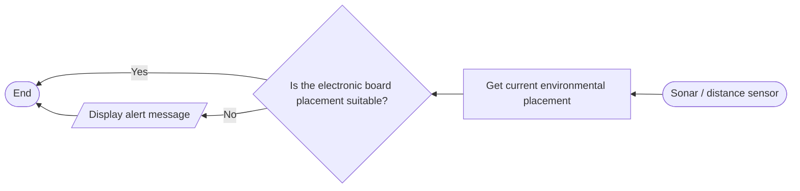
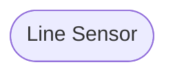

# Programming Logic

## Example Subsystem from Programming Logic Exercise (3/05/23)

# Logic Subsystems of my main assignment.

> For each behaviour, create the mermaid flowchart. Start each flowchart with a Heading naming the functionality. Delete this comment prior to submission.

## Sonar Logic Subsystem

## Line Sensor Subsystem

