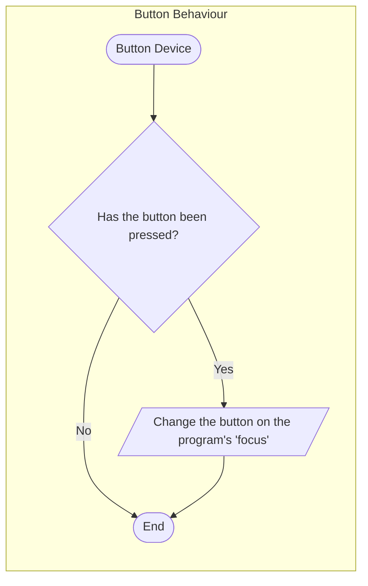
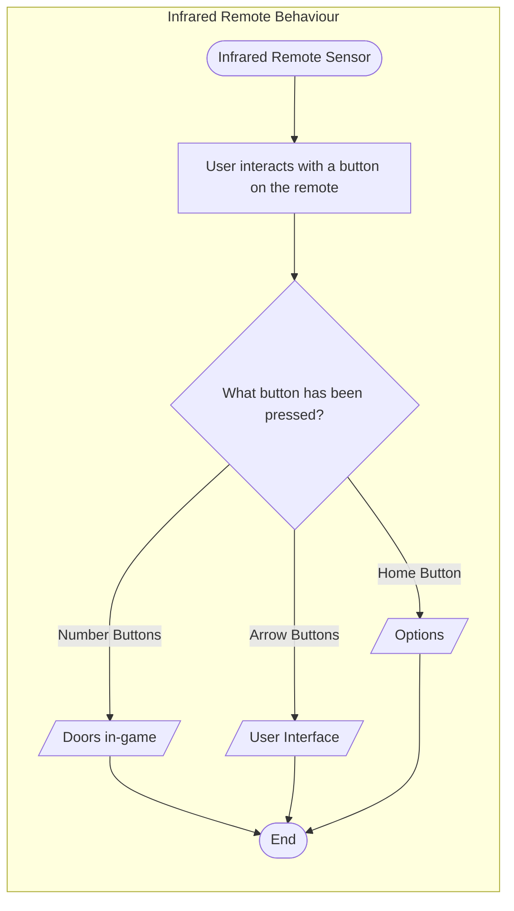
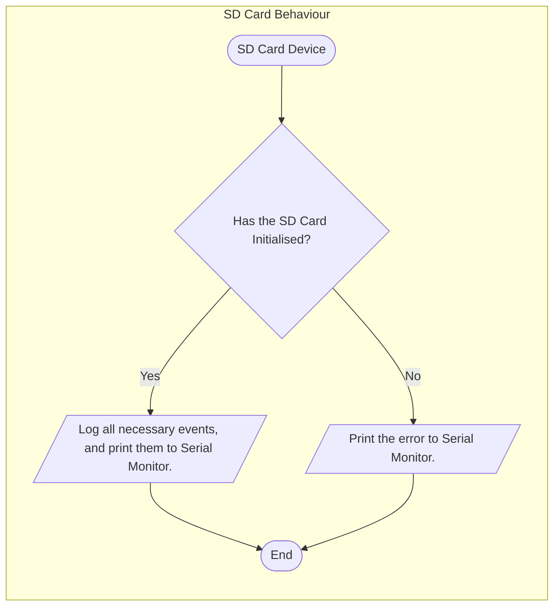
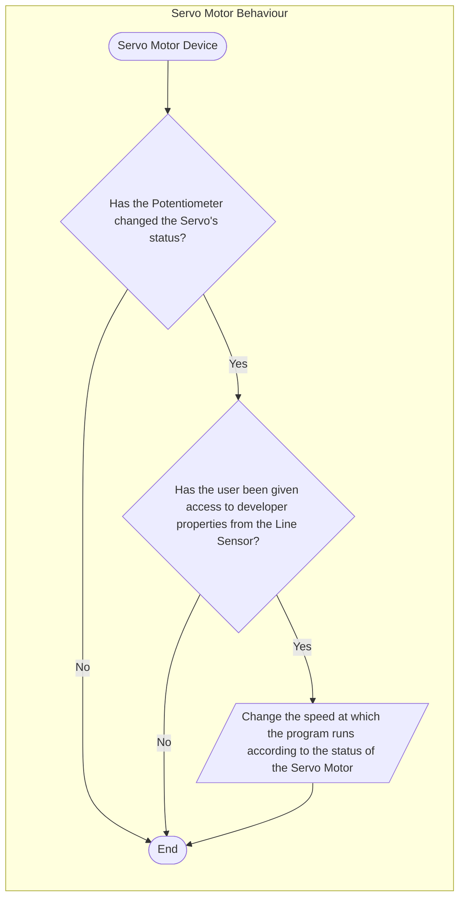
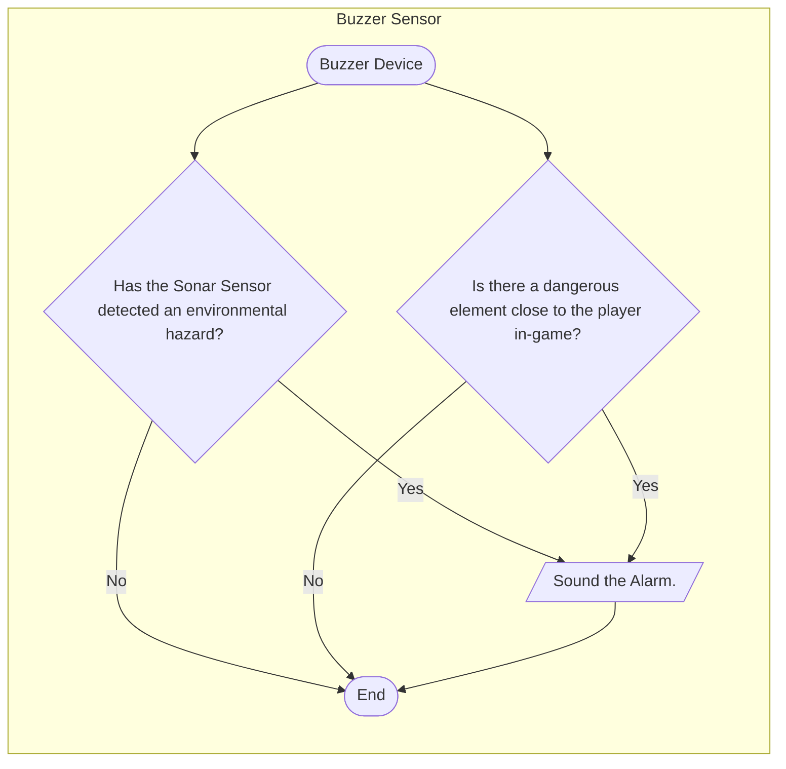
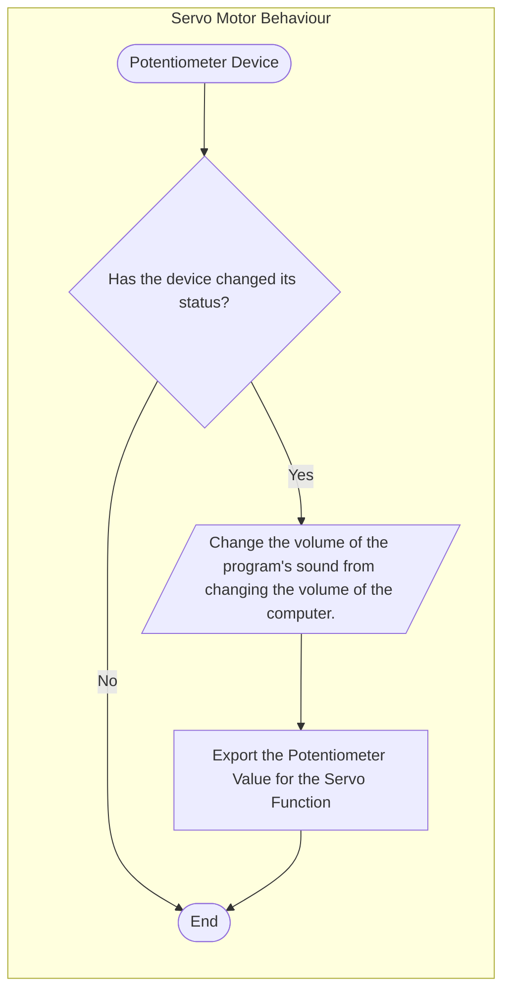
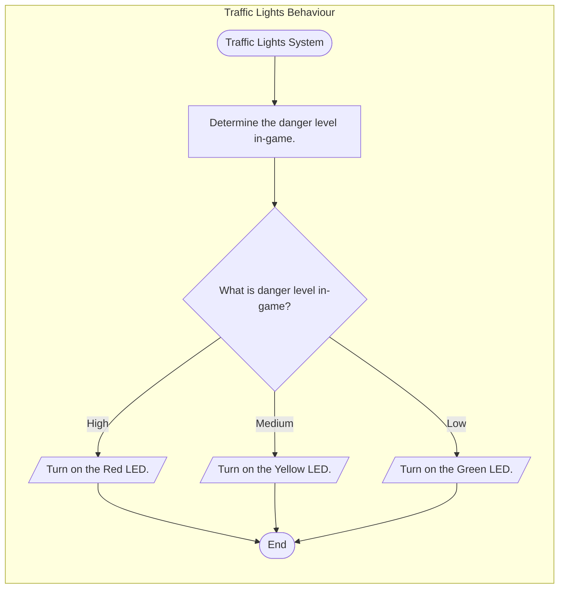

# Logic Subsystems of my main assignment.

> Behaviours as short sentences, with each behaviour represented in the following subsystems.

## Sonar Logic Subsystem
    When the Sonar / Distance Sensor detects an edge or wall 10 to 15 centimetres from the electric board, the Buzzer can activate as an alarm.

## Line Sensor Subsystem
    When the Line Sensor detects a specific barcode or type of line, the game’s monitor will change scenes.

## Button Subsystem
    When the button is pressed, the game monitor’s interface will be interacted with. The player can access the game’s UI through the use of the button.

## Infrared Remote Subsystem
    When the Infrared Remote Control is used:
        The arrow keys on a remote can interact with the doors in-game per press.
        The menu buttons (for example, ‘home’) will activate the game’s UI, for the button’s use.

## SD Card Subsystem
    When the SD Card is saved as a file on the computer (sd card specific files), the Arduino mega can then (with sd card connected) read the data of the sd card file to the board for saved data to initialise.

## Servo Motor Subsystem
    When the Servo Motor’s state is changed, and the game developer portion of the monitor is initialised, the motor can change the overall speed of executing the program.

## Buzzer Subsystem
    When the buzzer is called upon by:
        The Sonar / Distance Sensor alarm (in the instance of a hazard), it will buzz (initialise).
        A specific danger element ‘in-game’, it will buzz (alert the player of a threat) and activate the red traffic light.
    

## Potentiometer Subsystem
    When the Potentiometer’s state is changed, the master sound of the game’s monitor will change accordingly.

## Traffic Lights Subsystem
    When the in-game threats are closer to the player character, the traffic lights will change colour accordingly (red being high danger, yellow is medium danger, and green is low danger).

## DC Motor Subsystem
    When the game program is active, the DC motor activates a slowly moving progress system, indicating the length of the game’s level, a clock-like system loosely attached to the electronic board.

